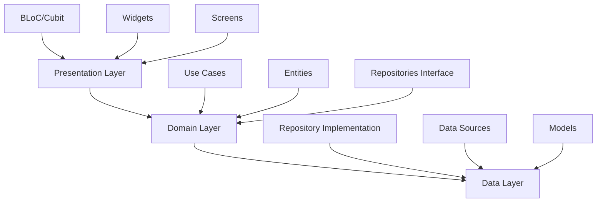

# تصميم شامل لإصلاح وتحسين تطبيق وصلة أكاديمي

## نظرة عامة

هذا التصميم يقدم حلول شاملة لجميع المشاكل المكتشفة في تطبيق وصلة أكاديمي، مع التركيز على إنشاء بنية تحتية قوية وقابلة للصيانة.

## البنية المعمارية

### 1. بنية المشروع المحسنة

```
lib/
├── core/                          # الأساسيات المشتركة
│   ├── constants/                 # الثوابت
│   ├── errors/                    # إدارة الأخطاء
│   ├── network/                   # طبقة الشبكة
│   ├── storage/                   # التخزين المحلي
│   ├── utils/                     # الأدوات المساعدة
│   └── validators/                # التحقق من البيانات
├── features/                      # الميزات حسب المجال
│   ├── auth/                      # المصادقة
│   │   ├── data/                  # طبقة البيانات
│   │   ├── domain/                # منطق العمل
│   │   └── presentation/          # واجهة المستخدم
│   ├── courses/                   # الكورسات
│   ├── profile/                   # الملف الشخصي
│   └── notifications/             # الإشعارات
├── shared/                        # المكونات المشتركة
│   ├── widgets/                   # العناصر القابلة لإعادة الاستخدام
│   ├── themes/                    # التصاميم والألوان
│   └── extensions/                # التوسيعات
└── main.dart
```

### 2. نمط Clean Architecture



## المكونات والواجهات

### 1. إدارة الحالة الموحدة

#### AuthBloc المحسن
```dart
// الأحداث
abstract class AuthEvent extends Equatable {}

class AuthLoginRequested extends AuthEvent {
  final String email;
  final String password;
  final bool rememberMe;
}

class AuthLogoutRequested extends AuthEvent {}

class AuthTokenRefreshRequested extends AuthEvent {}

// الحالات
abstract class AuthState extends Equatable {}

class AuthInitial extends AuthState {}
class AuthLoading extends AuthState {}
class AuthAuthenticated extends AuthState {
  final User user;
  final String token;
}
class AuthUnauthenticated extends AuthState {}
class AuthError extends AuthState {
  final String message;
  final ErrorType type;
}
```

#### CourseBloc المحسن
```dart
abstract class CourseEvent extends Equatable {}

class CoursesLoadRequested extends CourseEvent {
  final CourseFilter? filter;
  final String? searchQuery;
}

class CourseEnrollRequested extends CourseEvent {
  final String courseId;
}

class CourseLessonCompleted extends CourseEvent {
  final String courseId;
  final String lessonId;
}

abstract class CourseState extends Equatable {}

class CourseInitial extends CourseState {}
class CourseLoading extends CourseState {}
class CoursesLoaded extends CourseState {
  final List<Course> courses;
  final bool hasMore;
}
class CourseError extends CourseState {
  final String message;
  final ErrorType type;
}
```

### 2. طبقة البيانات المحسنة

#### Repository Pattern
```dart
abstract class CourseRepository {
  Future<Either<Failure, List<Course>>> getCourses({
    CourseFilter? filter,
    String? searchQuery,
    int page = 1,
  });
  
  Future<Either<Failure, Course>> getCourseById(String id);
  Future<Either<Failure, void>> enrollInCourse(String courseId);
  Future<Either<Failure, void>> markLessonComplete(String lessonId);
}

class CourseRepositoryImpl implements CourseRepository {
  final CourseRemoteDataSource remoteDataSource;
  final CourseLocalDataSource localDataSource;
  final NetworkInfo networkInfo;

  @override
  Future<Either<Failure, List<Course>>> getCourses({
    CourseFilter? filter,
    String? searchQuery,
    int page = 1,
  }) async {
    if (await networkInfo.isConnected) {
      try {
        final courses = await remoteDataSource.getCourses(
          filter: filter,
          searchQuery: searchQuery,
          page: page,
        );
        await localDataSource.cacheCourses(courses);
        return Right(courses);
      } catch (e) {
        return Left(ServerFailure(e.toString()));
      }
    } else {
      try {
        final courses = await localDataSource.getCachedCourses();
        return Right(courses);
      } catch (e) {
        return Left(CacheFailure(e.toString()));
      }
    }
  }
}
```

#### Data Sources
```dart
abstract class CourseRemoteDataSource {
  Future<List<CourseModel>> getCourses({
    CourseFilter? filter,
    String? searchQuery,
    int page = 1,
  });
}

class CourseRemoteDataSourceImpl implements CourseRemoteDataSource {
  final ApiClient apiClient;

  @override
  Future<List<CourseModel>> getCourses({
    CourseFilter? filter,
    String? searchQuery,
    int page = 1,
  }) async {
    final response = await apiClient.get(
      '/courses',
      queryParameters: {
        if (filter != null) ...filter.toJson(),
        if (searchQuery != null) 'search': searchQuery,
        'page': page,
      },
    );
    
    return (response.data['courses'] as List)
        .map((json) => CourseModel.fromJson(json))
        .toList();
  }
}
```

### 3. إدارة الأخطاء المحسنة

```dart
abstract class Failure extends Equatable {
  final String message;
  const Failure(this.message);
}

class ServerFailure extends Failure {
  const ServerFailure(String message) : super(message);
}

class CacheFailure extends Failure {
  const CacheFailure(String message) : super(message);
}

class NetworkFailure extends Failure {
  const NetworkFailure(String message) : super(message);
}

class ValidationFailure extends Failure {
  const ValidationFailure(String message) : super(message);
}

// Error Handler
class ErrorHandler {
  static String getErrorMessage(Failure failure) {
    switch (failure.runtimeType) {
      case ServerFailure:
        return 'خطأ في الخادم. يرجى المحاولة لاحقاً';
      case NetworkFailure:
        return 'لا يوجد اتصال بالإنترنت';
      case CacheFailure:
        return 'خطأ في تحميل البيانات المحفوظة';
      case ValidationFailure:
        return failure.message;
      default:
        return 'حدث خطأ غير متوقع';
    }
  }
}
```

## نماذج البيانات

### 1. نماذج محسنة مع التحقق

```dart
class User extends Equatable {
  final String id;
  final String name;
  final String email;
  final String? phone;
  final String? avatar;
  final UserRole role;
  final List<String> enrolledCourses;
  final List<String> completedCourses;
  final DateTime createdAt;
  final DateTime? lastLoginAt;

  const User({
    required this.id,
    required this.name,
    required this.email,
    this.phone,
    this.avatar,
    required this.role,
    required this.enrolledCourses,
    required this.completedCourses,
    required this.createdAt,
    this.lastLoginAt,
  });

  // Validation
  String? validateEmail() {
    if (!RegExp(r'^[\w-\.]+@([\w-]+\.)+[\w-]{2,4}$').hasMatch(email)) {
      return 'البريد الإلكتروني غير صحيح';
    }
    return null;
  }

  String? validateName() {
    if (name.trim().length < 2) {
      return 'الاسم يجب أن يكون أكثر من حرفين';
    }
    return null;
  }

  // Copy with
  User copyWith({
    String? name,
    String? email,
    String? phone,
    String? avatar,
    List<String>? enrolledCourses,
    List<String>? completedCourses,
    DateTime? lastLoginAt,
  }) {
    return User(
      id: id,
      name: name ?? this.name,
      email: email ?? this.email,
      phone: phone ?? this.phone,
      avatar: avatar ?? this.avatar,
      role: role,
      enrolledCourses: enrolledCourses ?? this.enrolledCourses,
      completedCourses: completedCourses ?? this.completedCourses,
      createdAt: createdAt,
      lastLoginAt: lastLoginAt ?? this.lastLoginAt,
    );
  }
}

enum UserRole { student, instructor, admin }
```

### 2. نماذج الكورسات المحسنة

```dart
class Course extends Equatable {
  final String id;
  final String title;
  final String description;
  final String category;
  final CourseLevel level;
  final double price;
  final String? imageUrl;
  final String instructorId;
  final String instructorName;
  final String? instructorAvatar;
  final double rating;
  final int studentsCount;
  final Duration duration;
  final bool isFree;
  final CourseStatus status;
  final List<Lesson> lessons;
  final List<Exam> exams;
  final List<Resource> resources;
  final DateTime createdAt;
  final DateTime updatedAt;

  const Course({
    required this.id,
    required this.title,
    required this.description,
    required this.category,
    required this.level,
    required this.price,
    this.imageUrl,
    required this.instructorId,
    required this.instructorName,
    this.instructorAvatar,
    required this.rating,
    required this.studentsCount,
    required this.duration,
    required this.isFree,
    required this.status,
    required this.lessons,
    required this.exams,
    required this.resources,
    required this.createdAt,
    required this.updatedAt,
  });

  // Computed properties
  bool get isPublished => status == CourseStatus.published;
  int get lessonsCount => lessons.length;
  int get examsCount => exams.length;
  Duration get totalDuration => lessons.fold(
    Duration.zero,
    (total, lesson) => total + lesson.duration,
  );
}

enum CourseLevel { beginner, intermediate, advanced }
enum CourseStatus { draft, published, archived }
```

## إدارة الأخطاء

### 1. نظام أخطاء شامل

```dart
class AppError {
  final String code;
  final String message;
  final String? details;
  final ErrorSeverity severity;
  final DateTime timestamp;

  AppError({
    required this.code,
    required this.message,
    this.details,
    required this.severity,
    DateTime? timestamp,
  }) : timestamp = timestamp ?? DateTime.now();
}

enum ErrorSeverity { low, medium, high, critical }

class ErrorLogger {
  static void logError(AppError error) {
    // Log to console in debug mode
    if (kDebugMode) {
      print('ERROR [${error.severity}]: ${error.message}');
      if (error.details != null) {
        print('Details: ${error.details}');
      }
    }
    
    // Log to crash analytics in production
    // FirebaseCrashlytics.instance.recordError(error, null);
  }
}
```

### 2. Error Boundary Widget

```dart
class ErrorBoundary extends StatelessWidget {
  final Widget child;
  final Widget Function(String error)? errorBuilder;

  const ErrorBoundary({
    Key? key,
    required this.child,
    this.errorBuilder,
  }) : super(key: key);

  @override
  Widget build(BuildContext context) {
    return BlocListener<GlobalErrorBloc, GlobalErrorState>(
      listener: (context, state) {
        if (state is GlobalErrorOccurred) {
          _showErrorDialog(context, state.error);
        }
      },
      child: child,
    );
  }

  void _showErrorDialog(BuildContext context, AppError error) {
    showDialog(
      context: context,
      builder: (context) => AlertDialog(
        title: Text('خطأ'),
        content: Text(error.message),
        actions: [
          TextButton(
            onPressed: () => Navigator.of(context).pop(),
            child: Text('موافق'),
          ),
        ],
      ),
    );
  }
}
```

## استراتيجية الاختبار

### 1. اختبارات الوحدة

```dart
// Test for AuthBloc
class MockAuthRepository extends Mock implements AuthRepository {}

void main() {
  group('AuthBloc', () {
    late AuthBloc authBloc;
    late MockAuthRepository mockRepository;

    setUp(() {
      mockRepository = MockAuthRepository();
      authBloc = AuthBloc(repository: mockRepository);
    });

    blocTest<AuthBloc, AuthState>(
      'emits [AuthLoading, AuthAuthenticated] when login succeeds',
      build: () {
        when(() => mockRepository.login(any(), any()))
            .thenAnswer((_) async => Right(tUser));
        return authBloc;
      },
      act: (bloc) => bloc.add(AuthLoginRequested('test@test.com', 'password')),
      expect: () => [
        AuthLoading(),
        AuthAuthenticated(user: tUser, token: 'token'),
      ],
    );
  });
}
```

### 2. اختبارات التكامل

```dart
void main() {
  group('Course Flow Integration Tests', () {
    testWidgets('User can browse and enroll in course', (tester) async {
      await tester.pumpWidget(MyApp());
      
      // Navigate to courses
      await tester.tap(find.byKey(Key('courses_tab')));
      await tester.pumpAndSettle();
      
      // Tap on first course
      await tester.tap(find.byType(CourseCard).first);
      await tester.pumpAndSettle();
      
      // Enroll in course
      await tester.tap(find.byKey(Key('enroll_button')));
      await tester.pumpAndSettle();
      
      // Verify enrollment success
      expect(find.text('تم التسجيل بنجاح'), findsOneWidget);
    });
  });
}
```

## الأمان والخصوصية

### 1. تشفير البيانات

```dart
class EncryptionService {
  static const String _key = 'your-32-character-secret-key-here';
  
  static String encrypt(String data) {
    final key = encrypt.Key.fromBase64(_key);
    final iv = encrypt.IV.fromSecureRandom(16);
    final encrypter = encrypt.Encrypter(encrypt.AES(key));
    
    final encrypted = encrypter.encrypt(data, iv: iv);
    return '${iv.base64}:${encrypted.base64}';
  }
  
  static String decrypt(String encryptedData) {
    final parts = encryptedData.split(':');
    final iv = encrypt.IV.fromBase64(parts[0]);
    final encrypted = encrypt.Encrypted.fromBase64(parts[1]);
    
    final key = encrypt.Key.fromBase64(_key);
    final encrypter = encrypt.Encrypter(encrypt.AES(key));
    
    return encrypter.decrypt(encrypted, iv: iv);
  }
}
```

### 2. إدارة الرموز المميزة

```dart
class TokenManager {
  static const String _accessTokenKey = 'access_token';
  static const String _refreshTokenKey = 'refresh_token';
  
  static Future<void> saveTokens({
    required String accessToken,
    required String refreshToken,
  }) async {
    final prefs = await SharedPreferences.getInstance();
    await prefs.setString(_accessTokenKey, EncryptionService.encrypt(accessToken));
    await prefs.setString(_refreshTokenKey, EncryptionService.encrypt(refreshToken));
  }
  
  static Future<String?> getAccessToken() async {
    final prefs = await SharedPreferences.getInstance();
    final encrypted = prefs.getString(_accessTokenKey);
    if (encrypted != null) {
      return EncryptionService.decrypt(encrypted);
    }
    return null;
  }
  
  static Future<void> clearTokens() async {
    final prefs = await SharedPreferences.getInstance();
    await prefs.remove(_accessTokenKey);
    await prefs.remove(_refreshTokenKey);
  }
}
```

## تحسين الأداء

### 1. تحسين الصور

```dart
class OptimizedImage extends StatelessWidget {
  final String imageUrl;
  final double? width;
  final double? height;
  final BoxFit fit;

  const OptimizedImage({
    Key? key,
    required this.imageUrl,
    this.width,
    this.height,
    this.fit = BoxFit.cover,
  }) : super(key: key);

  @override
  Widget build(BuildContext context) {
    return CachedNetworkImage(
      imageUrl: imageUrl,
      width: width,
      height: height,
      fit: fit,
      placeholder: (context, url) => Shimmer.fromColors(
        baseColor: Colors.grey[300]!,
        highlightColor: Colors.grey[100]!,
        child: Container(
          width: width,
          height: height,
          color: Colors.white,
        ),
      ),
      errorWidget: (context, url, error) => Container(
        width: width,
        height: height,
        color: Colors.grey[200],
        child: Icon(Icons.error),
      ),
      memCacheWidth: width?.toInt(),
      memCacheHeight: height?.toInt(),
    );
  }
}
```

### 2. تحسين القوائم

```dart
class OptimizedListView extends StatelessWidget {
  final List<dynamic> items;
  final Widget Function(BuildContext, int) itemBuilder;
  final bool shrinkWrap;

  const OptimizedListView({
    Key? key,
    required this.items,
    required this.itemBuilder,
    this.shrinkWrap = false,
  }) : super(key: key);

  @override
  Widget build(BuildContext context) {
    return ListView.builder(
      itemCount: items.length,
      shrinkWrap: shrinkWrap,
      physics: const BouncingScrollPhysics(),
      cacheExtent: 500, // Cache items outside viewport
      itemBuilder: itemBuilder,
    );
  }
}
```

## إمكانية الوصول

### 1. دعم قارئ الشاشة

```dart
class AccessibleButton extends StatelessWidget {
  final String text;
  final VoidCallback onPressed;
  final String? semanticLabel;

  const AccessibleButton({
    Key? key,
    required this.text,
    required this.onPressed,
    this.semanticLabel,
  }) : super(key: key);

  @override
  Widget build(BuildContext context) {
    return Semantics(
      label: semanticLabel ?? text,
      button: true,
      child: ElevatedButton(
        onPressed: onPressed,
        child: Text(text),
      ),
    );
  }
}
```

### 2. دعم التباين العالي

```dart
class HighContrastTheme {
  static ThemeData get theme {
    return ThemeData(
      brightness: Brightness.light,
      primaryColor: Colors.black,
      backgroundColor: Colors.white,
      textTheme: TextTheme(
        bodyText1: TextStyle(
          color: Colors.black,
          fontSize: 18,
          fontWeight: FontWeight.w600,
        ),
      ),
      elevatedButtonTheme: ElevatedButtonThemeData(
        style: ElevatedButton.styleFrom(
          primary: Colors.black,
          onPrimary: Colors.white,
          side: BorderSide(color: Colors.black, width: 2),
        ),
      ),
    );
  }
}
```

## التوطين والترجمة

### 1. نظام ترجمة محسن

```dart
class AppLocalizations {
  static const LocalizationsDelegate<AppLocalizations> delegate =
      _AppLocalizationsDelegate();

  static AppLocalizations of(BuildContext context) {
    return Localizations.of<AppLocalizations>(context, AppLocalizations)!;
  }

  final Map<String, String> _localizedStrings;

  AppLocalizations(this._localizedStrings);

  String translate(String key) {
    return _localizedStrings[key] ?? key;
  }

  // Common translations
  String get appName => translate('app_name');
  String get login => translate('login');
  String get logout => translate('logout');
  String get courses => translate('courses');
  String get profile => translate('profile');
}
```

## مراقبة الأداء

### 1. تتبع الأداء

```dart
class PerformanceMonitor {
  static void trackScreenLoad(String screenName) {
    final stopwatch = Stopwatch()..start();
    
    WidgetsBinding.instance.addPostFrameCallback((_) {
      stopwatch.stop();
      final loadTime = stopwatch.elapsedMilliseconds;
      
      // Log performance metrics
      print('Screen $screenName loaded in ${loadTime}ms');
      
      // Send to analytics
      // FirebaseAnalytics.instance.logEvent(
      //   name: 'screen_load_time',
      //   parameters: {
      //     'screen_name': screenName,
      //     'load_time_ms': loadTime,
      //   },
      // );
    });
  }
}
```

هذا التصميم يوفر حلول شاملة لجميع المشاكل المكتشفة ويضع أساس قوي لتطوير التطبيق مستقبلاً.