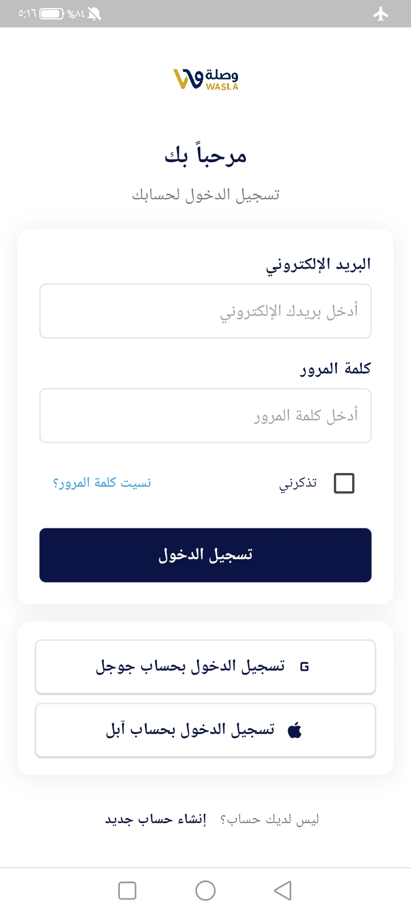
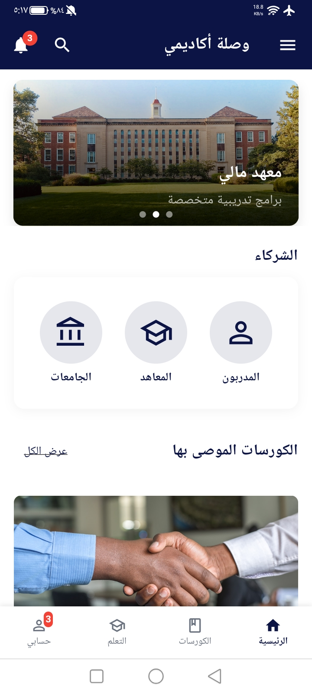
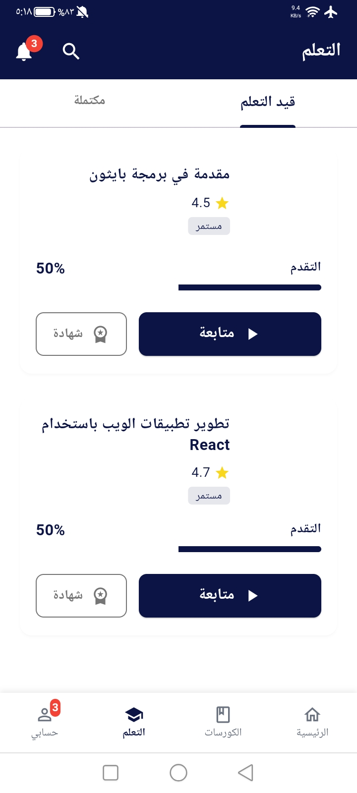
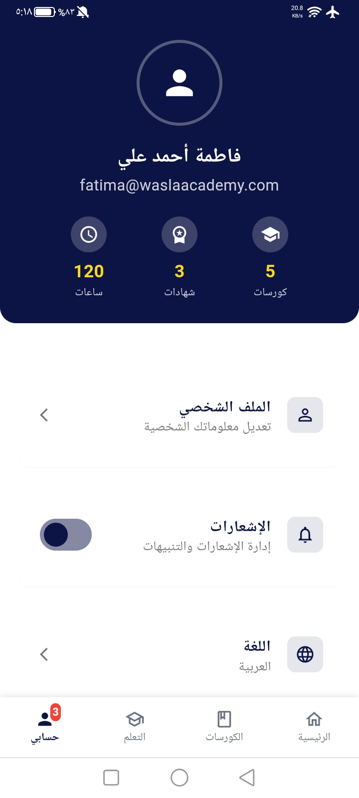

# Wasla Academy - Educational Platform

<p align="center">
  
</p>

<p align="center">
  <strong>An integrated e-learning platform connecting students with educational institutions across Yemen</strong>
</p>

<p align="center">
  <a href="#features">Features</a> •
  <a href="#screenshots">Screenshots</a> •
  <a href="#tech-stack">Tech Stack</a> •
  <a href="#getting-started">Getting Started</a> •
  <a href="#license">License</a>
</p>

## 📱 About Wasla Academy

**Wasla Academy** is a comprehensive educational platform built with Flutter that bridges the gap between students and educational service providers in Yemen. Our mission is to democratize education by providing accessible, high-quality learning opportunities to students regardless of their geographical location.

The platform enables:
- Students to discover and enroll in courses from universities, institutes, and individual trainers
- Educational institutions to showcase their offerings and reach a wider audience
- Interactive learning experiences through video lessons, exams, and discussion forums
- Verified digital certificates upon course completion

## 🌟 Key Features

### For Students
- 📚 **Course Discovery**: Browse courses by category, level, and provider
- 💰 **Flexible Pricing**: Access both free and premium courses
- ▶️ **Interactive Learning**: Video lessons, downloadable resources, and progress tracking
- 📝 **Assessments**: Take exams to test knowledge and earn certificates
- 👥 **Community Engagement**: Participate in course discussions and chat with instructors
- 🏆 **Achievements**: Earn certificates and track learning milestones

### For Educators & Institutions
- 🛠️ **Course Management**: Create and manage courses with lessons and exams
- 👥 **Student Interaction**: Monitor progress and engage through discussions
- 📊 **Analytics**: Track enrollment and performance metrics
- 🎓 **Certification**: Issue verified digital certificates to successful students

## 📸 Screenshots

<div style="display: flex; flex-wrap: wrap; gap: 10px;">
  
  
  
  
  
  
</div>

## ⚙️ Tech Stack

- **Framework**: [Flutter 3.4.3+](https://flutter.dev/)
- **State Management**: [BLoC Pattern](https://bloclibrary.dev/)
- **UI Architecture**: Material Design with custom widgets
- **Backend**: [Supabase](https://supabase.io/) (PostgreSQL, Authentication, Storage)
- **Localization**: Arabic (RTL) and English support
- **Responsive Design**: Adapts to mobile, tablet, and desktop screens

### Core Dependencies
```yaml
dependencies:
  flutter_bloc: ^8.1.5
  equatable: ^2.0.5
  flutter_screenutil: ^5.9.0
  cached_network_image: ^3.3.1
  carousel_slider: ^4.2.1
  video_player: ^2.9.2
  intl: ^0.19.0
  provider: ^6.1.5+1
  shared_preferences: ^2.3.2
  path_provider: ^2.1.4
```

## 🚀 Getting Started

### Prerequisites
- Flutter SDK 3.4.3+
- Dart SDK 3.0.0+
- Android Studio or VS Code
- Supabase account (for backend services)

### Installation

1. Clone the repository:
```bash
git clone https://github.com/fahm99/wasla_academy-ELearning-platform.git
cd wasla_academy-ELearning-platform
```

2. Install dependencies:
```bash
flutter pub get
```

3. Configure Supabase:
   - Create a Supabase project at [supabase.io](https://supabase.io/)
   - Update the configuration in `lib/src/config/supabase_config.dart`:
   ```dart
   static const String supabaseUrl = 'YOUR_SUPABASE_URL';
   static const String supabaseAnonKey = 'YOUR_SUPABASE_ANON_KEY';
   ```

4. Run the app:
```bash
flutter run
```

## 🗂️ Project Structure

```
lib/
├── src/
│   ├── user/
│   │   ├── blocs/           # Business Logic Components
│   │   ├── constants/       # App themes, colors, sizes
│   │   ├── data/            # Data models and repositories
│   │   ├── models/          # Domain models
│   │   ├── services/        # External services
│   │   ├── utils/           # Helper functions
│   │   ├── views/           # Screens and pages
│   │   └── widgets/         # Reusable UI components
│   └── main.dart            # App entry point
assets/
├── data/                    # JSON data files
├── images/                  # Image assets
└── screens/                 # Application screenshots
```

## 🧪 Testing

Run the test suite:
```bash
flutter test
```

Run code analysis:
```bash
flutter analyze
```

Format code:
```bash
flutter format .
```

## 📦 Build for Production

### Android
```bash
flutter build apk --release
# or for Google Play
flutter build appbundle --release
```

### iOS
```bash
flutter build ios --release
```

## 🤝 Contributing

Contributions are welcome! Here's how you can help:

1. Fork the repository
2. Create a feature branch (`git checkout -b feature/AmazingFeature`)
3. Commit your changes (`git commit -m 'Add some AmazingFeature'`)
4. Push to the branch (`git push origin feature/AmazingFeature`)
5. Open a Pull Request

Please ensure your code follows the project's coding standards and includes appropriate tests.

## 📄 License

This project is licensed under the MIT License - see the [LICENSE](LICENSE) file for details.
